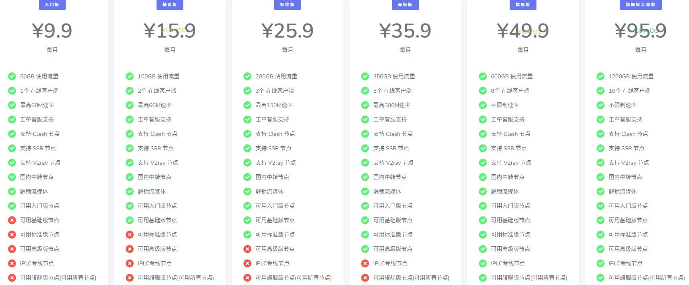

# 疾风云官网地址2025最新入口 + 优惠码

下面是最新地址：

永久官网：[http://jifengcloud.net](https://xuv.cc/out/jifeng)

地址1：[https://jif44.net](https://jif44.net/auth/register?code=PLZY)

地址2：[https://jfdog.net](https://jfdog.net/auth/register?code=PLZY)

地址3：[https://jfcat.net](https://jfcat.net/auth/register?code=PLZY)

---

**温馨提示：任何服务均有跑路风险，请自行注意防范！**

**本页面仅分享网络信息，不做推荐，有问题请自行联系服务商处理！**

---

## 简介

疾风云怎么样？jifengCloud疾风云，老牌服务商旗下的新开分站，支持 Clash 节点，支持 SSR 节点，支持 V2ray 节点、Trojan节点，国内中转节点。

解锁流媒体，IPLC专线节点。最高不限制速率，最多10个在线客户端。

节点国家或地区包括：香港, 台湾, 日本, 法国, 美国, 韩国, 马来西亚, 新加坡等。

## 疾风云优惠码

疾风云最新优惠码

疾风云2025包年6.9折优惠代码（长期有效）：[jf2025](https://xuv.cc/out/jifeng)

## 疾风云特色优势

+ 便宜梯子，定价实惠，月付9元至95元，极具性价比；
+ 套餐配置灵活，可满足不同用户的绝大部分应用需求；
+ 全部节点线路采用隧道中转优化及 IPLC 高速专线；
+ 多达条优质线路，集中分布美、日、韩、港、台、新等热门地区；
+ 所有套餐均支持 Netflix、TVB 等国外流媒体解锁；
+ 支持全平台 Windows、Mac、Linux、Android、iOS 等各种操作系统的 ShadowsocksR (SSR)、V2Ray、Trojan 协议订阅，抗封锁能力强；
+ 站内提供订阅转换，方便不同协议配置，避免订阅信息泄露；
+ 新晋稳定便宜梯子，用户少不拥挤，带宽速度体验佳；

## 疾风云套餐价格列表

|套餐|入门版|基础版|标准版|高级版|旗舰版|旗舰版大流量|
|----|----|----|----|----|----|----|
|月付|¥9.9|¥15.99|¥25.99|¥35.99|¥49.99|¥95.99|
|季付|¥29.97|¥49.97|¥77.97|¥107.97|¥149.97|¥287.97|
|半年付|¥59.94|¥95.94|¥155.94|¥215.94|¥299.94|¥575.94|
|年付|¥119.88|¥191.88|¥311.88|¥431.88|¥599.88|¥1151.88|
|两年付|¥239.76|¥383.76|¥623.76|¥863.76|¥1199.76|¥2303.76|

---

**温馨提示：任何服务均有跑路风险，请自行注意防范！**

**本页面仅分享网络信息，不做推荐，有问题请自行联系服务商处理！**

---
